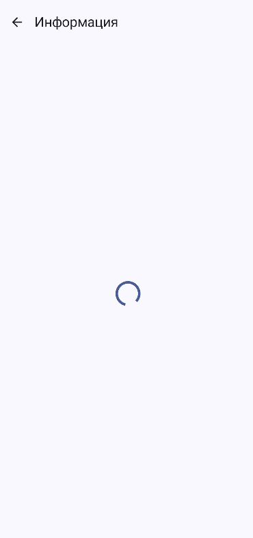
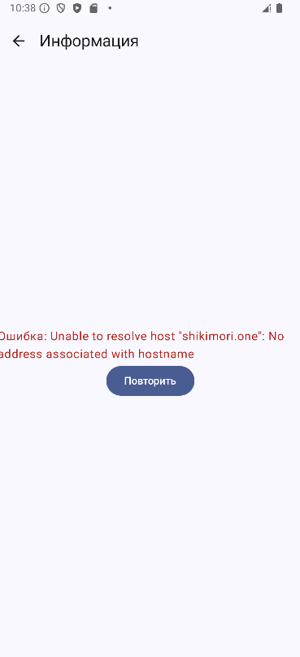
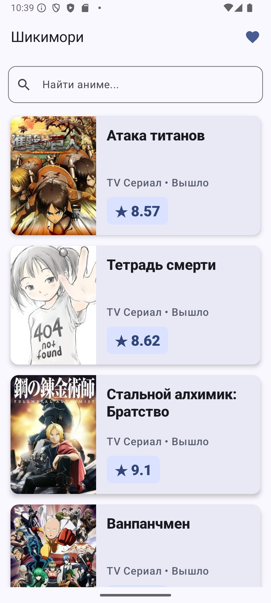
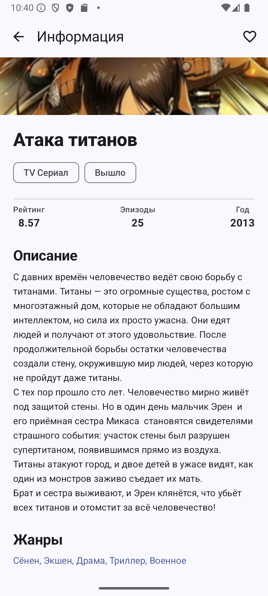

**Выполнил:** Копаницкий Захар Александрович
**Группа:** ПИКД 2 подгруппа

---

## API

**Название:** Shikimori API
**Ссылка:** `https://shikimori.one/api/doc/1.0`
**Что дает:** Предоставляет информацию об аниме (списки, поиск, детали, рейтинги, постеры).
**Ключ:** Не требуется (Open API).

## Запуск

1. Открыть проект в Android Studio.
2. Дождаться синхронизации Gradle.
3. Запустить на эмуляторе или реальном устройстве (Android 7.0+).
4. Интернет соединение обязательно.

## Скриншоты

| Loading | Error |
|:---:|:---:|
|  |  |

| List | Detail | Favourites (Room State) |
|:---:|:---:|:---:|
|  |  |  |

---

## Домашнее задание 4 (Hilt + Room)

### Hilt

- DI подключён и используется (`@HiltAndroidApp`, `@HiltViewModel`, `@AndroidEntryPoint`).
- Зависимости (Retrofit, Room, Repository) инжектятся через конструкторы, а не создаются внутри классов.
- Решены проблемы с тесной связанностью слоёв (repository прилетает извне).

### Room

- **Сценарий:** `Favourites` (Избранное).
- **Что храним:** Сохраняются базовые данные об аниме (название, постер, рейтинг, статус) в таблице `favourites` (сущность `AnimeEntity`).
- **Как проверить:**
  1. Открыть приложение, дождаться загрузки списка.
  2. Перейти в детали любого аниме и нажать на сердечко (добавить в Избранное).
  3. Открыть экран "Избранное" (иконка сердечка на главном экране) — убедиться, что аниме там появилось.
  4. Полностью закрыть приложение (свайпнуть из недавних/Recent Apps).
  5. Открыть приложение заново, перейти в "Избранное" — добавленное аниме должно остаться на месте (пережило перезапуск).

---

## Что исправлено в последних коммитах
- **Retry Logic:** исправлен баг в реактивной цепочке `listUiState`, из-за которого кнопка "Повторить" не работала при неизменном поисковом запросе.
- **Reactive Detail State:** экран деталей полностью переведен на реактивный подход (flatMapLatest).
- **DDD Refactoring & Layer Isolation:** создан слой `domain`, модели полностью очищены от сторонних зависимостей (GSON). `AnimeViewModel` теперь изолирована от деталей слоя данных (маппинг вынесен в репозиторий).
- **Performance Optimization:** ресурсозатратная очистка описаний (Regex) перенесена из доменной модели в маппер (выполняется один раз при получении данных).
- **Room Transactions:** логика избранного перенесена в `@Transaction` внутри DAO.
- **Hardcode Removal:** конфигурации вынесены в `BuildConfig`, строки — в `strings.xml`.
- **UI Compliance & Previews:** добавлены функции `@Preview` для всех компонентов и экранов согласно стандартам проекта. Исправлена кодировка символов и очистка текста.
- **Lifecycle Awareness:** внедрен `collectAsStateWithLifecycle()` для безопасной работы с потоками данных.
