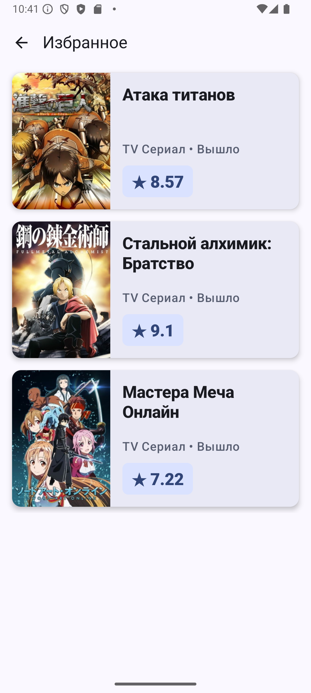

# Домашнее задание 3 - Android Application

**Выполнил:** Копаницкий Захар Александрович
**Группа:** ПИКД 7

---

## API
**Название:** Shikimori API
**Ссылка:** `https://shikimori.one/api/doc/1.0`
**Что дает:** Предоставляет информацию об аниме (списки, поиск, детали, рейтинги, постеры).
**Ключ:** Не требуется (Open API).

## Запуск
1. Открыть проект в Android Studio.
2. Дождаться синхронизации Gradle.
3. Запустить на эмуляторе или реальном устройстве (Android 7.0+).
4. Интернет соединение обязательно.

## Скриншоты

| Loading | Error |
|:---:|:---:|
|  |  |

| List | Detail | Favourites |
|:---:|:---:|:---:|
|  |  |  |

---

## Чеклист (выполнено)

### Обязательный функционал
- [x] **A) Навигация:** Реализовано 3 экрана (List, Detail, Favourites) через Navigation Compose.
- [x] **B) Архитектура:**
    - UI State (Loading, Error, Success, Empty).
    - ViewModel (AnimeViewModel).
    - Repository (AnimeRepository).
    - UI максимально stateless.
- [x] **C) Coroutines + Retrofit:** Все запросы асинхронны, запускаются в `viewModelScope`.
- [x] **D) UI состояния:**
    - Loading (индикатор).
    - Error (сообщение + кнопка Retry).
    - Empty (заглушка).
    - Success (список данных).
- [x] **E) Избранное:** Локальное сохранение в памяти (переживает поворот экрана).

### Технические требования
- [x] Jetpack Compose + Material3.
- [x] Navigation Compose.
- [x] ViewModel + viewModelScope.
- [x] Retrofit + Gson.
- [x] Без Flow (использовался StateFlow, что соответствует требованиям "можно").

### Бонусы
- [x] **Debounce поиска:** Реализовано через `Job + delay(500ms)` во ViewModel.
- [x] **Экран Favourites:** Вынесен в отдельный route навигации.
- [x] **Логирование запросов:** Подключен `HttpLoggingInterceptor`.